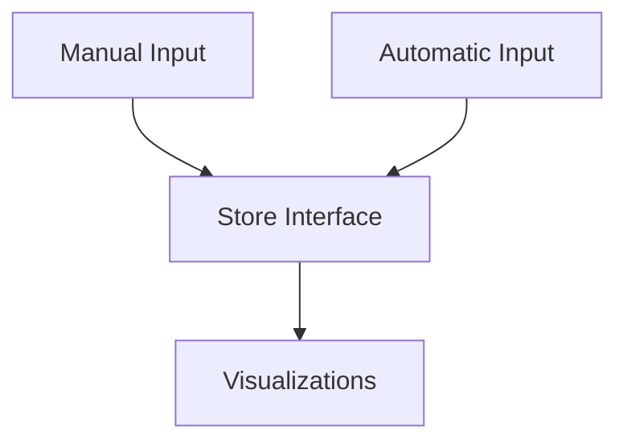

# Health Design Doc

## Requirements
1. Track key health metrics over time
  - examples: weight, calories in the form of meals, sleep, cholesterol, blood pressure, etc.
2. goals
  - A goal is a thing we want to achieve defined by one or more metrics, a target value, and a time frame.
3. support multiple users

## Data Flow

## Input Types 
1. Manual Input 
   - User enters data directly into the app.
   - Examples: Weight, Calories consumed, Exercise details.
2. Automatic Input
   - Data is collected via connected devices or apps.
   - Examples: Fitness trackers, Smart scales.

## Architecture
each metric can be defined as follows. 

Metrics define the following 
- data input
- data serialization
- data visualization

Goals are defined as follows
- target metric
- target value
- start date
- end date
- progress tracking (current value, percentage complete)
